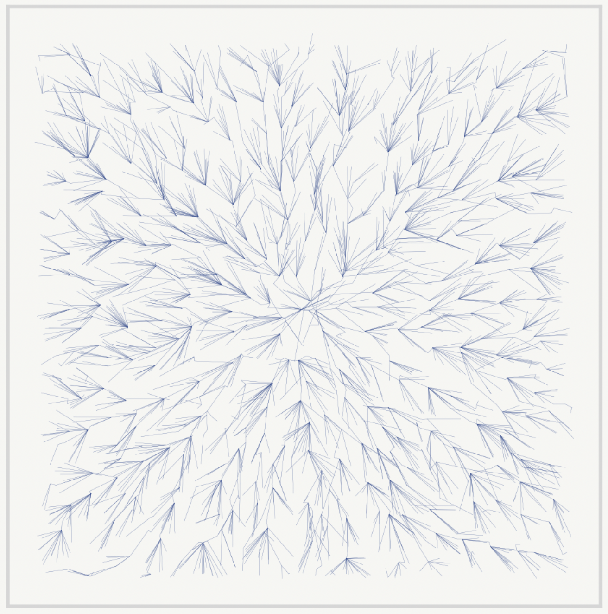

# RRT* Search Algorithm for Robotic Path Planning
This code implements Real Time RRT* Tree search visualized in a low code UI. This project is written in [Pure Python](https://github.com/BrianLesko/rrt-star/blob/main/app.py) in under 60 lines of code. Created by Brian Lesko for Learning Purposes.

&nbsp;

<div align="center"></div>

&nbsp;

## Dependencies

This code uses the following libraries:
- `streamlit`: for building the user interface.
- `numpy`: for creating arrays.
- `matplotlib`: for saving image data


&nbsp;

## Usage

Run the following commands:
```
pip install --upgrade streamlit matplotlib
streamlit run https://raw.githubusercontent.com/BrianLesko/rrt-star/main/app.py
```

This will start the local Streamlit server, and you can access the chatbot by opening a web browser and navigating to `http://localhost:8501`.

&nbsp;

## Repository Structure
```
repository/
├── app.py # the code and UI integrated together live here
├── customize_gui # class for adding gui elements
├── requirements.txt # the python packages needed to run locally
├── .gitignore # includes the local virtual environment named my_env
├── rrt.py # methods needed for RRT and RRT*
├── .streamlit/
│   └── config.toml # theme info for the UI
└── docs/
    └── preview.png # preview photo for Github
```

&nbsp;

## Topics 
```
Python | Streamlit | Git | Low Code UI | path planning | tree search | random trees 
Mechanical engineer | Robotics engineer | Engineering
```
&nbsp;

<hr>

&nbsp;

<div align="center">


╭━━╮╭━━━┳━━┳━━━┳━╮╱╭╮        ╭╮╱╱╭━━━┳━━━┳╮╭━┳━━━╮
┃╭╮┃┃╭━╮┣┫┣┫╭━╮┃┃╰╮┃┃        ┃┃╱╱┃╭━━┫╭━╮┃┃┃╭┫╭━╮┃
┃╰╯╰┫╰━╯┃┃┃┃┃╱┃┃╭╮╰╯┃        ┃┃╱╱┃╰━━┫╰━━┫╰╯╯┃┃╱┃┃
┃╭━╮┃╭╮╭╯┃┃┃╰━╯┃┃╰╮┃┃        ┃┃╱╭┫╭━━┻━━╮┃╭╮┃┃┃╱┃┃
┃╰━╯┃┃┃╰┳┫┣┫╭━╮┃┃╱┃┃┃        ┃╰━╯┃╰━━┫╰━╯┃┃┃╰┫╰━╯┃
╰━━━┻╯╰━┻━━┻╯╱╰┻╯╱╰━╯        ╰━━━┻━━━┻━━━┻╯╰━┻━━━╯
  


&nbsp;


<a href="https://twitter.com/BrianJosephLeko"></a> &nbsp; &nbsp; &nbsp; &nbsp; &nbsp; &nbsp; <a href="https://github.com/BrianLesko"></a> &nbsp; &nbsp; &nbsp; &nbsp; &nbsp; &nbsp; <a href="https://www.linkedin.com/in/brianlesko/"></a>

follow all of these for a cookie :)

</div>


&nbsp;


